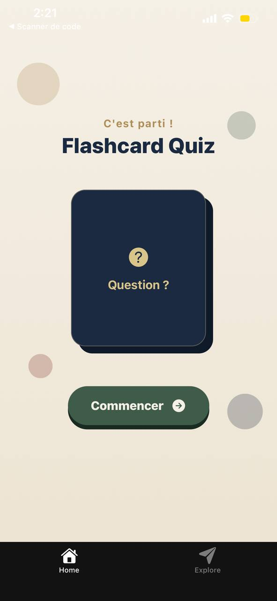
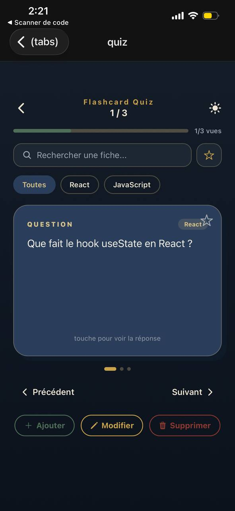

# 📚 Flashcard Quiz App

Une application mobile de flashcards pour réviser, construite avec **React Native** et **Expo**.

<p align="center">
  

</p>

## ✨ Fonctionnalités

- 🔄 **Cartes retournables en 3D** — question au recto, réponse au verso
- 📂 **Catégories** — organise tes fiches par matière
- 🔍 **Recherche** — retrouve une fiche par mot-clé, dans la question ou la réponse
- ⭐ **Favoris** — marque tes fiches importantes pour les retrouver rapidement
- 📊 **Suivi de progression** — visualise combien de fiches tu as déjà révisées
- 🌙 **Mode sombre** — bascule entre thème clair et sombre, préférence sauvegardée
- ✏️ **CRUD complet** — ajoute, modifie et supprime tes propres fiches
- 💾 **Stockage local persistant** — tes données restent après fermeture de l'app

## 🛠️ Stack technique

`React Native` · `Expo (SDK 54)` · `TypeScript` · `Expo Router` · `NativeWind` · `React Native Reanimated` · `AsyncStorage` · `React Context API`

## 🚀 Installation

```bash
git clone https://github.com/kawther444/flashcard-Quiz-app.git
cd flashcard-Quiz-app
npm install
npx expo start
```

Scanne le QR code avec l'app **Expo Go** (Android/iOS), ou appuie sur `w` pour ouvrir dans le navigateur.

## 📖 À propos

Projet réalisé dans le cadre de mon apprentissage de React/React Native, en parallèle de mes études à ISIA.